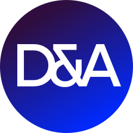
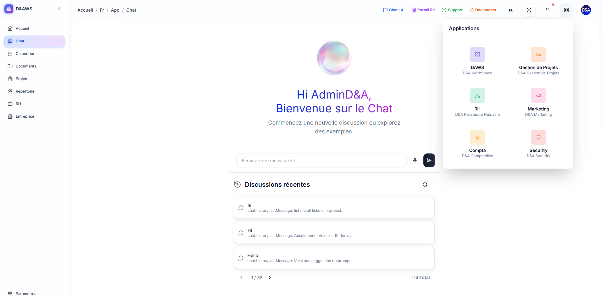
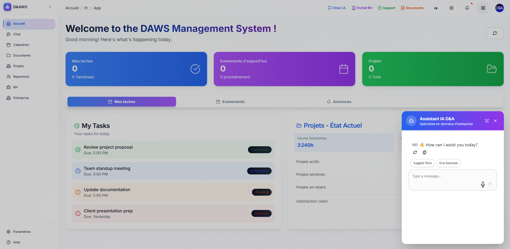
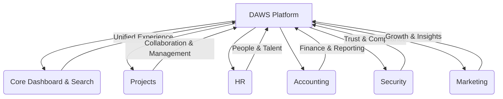

# DAWS: The AI-Powered All-in-One Platform for Modern Business



[](https://github.com/taryaoui/DAWS-public/blob/main/LICENSE)

Welcome to **DAWS (D&A WorkSpace)** — the next-generation, AI-driven platform designed to unify, empower, and future-proof your organization. DAWS is more than just software: it’s your company’s digital backbone for the AI era, built to accelerate growth, boost productivity, and ensure security and compliance at every step.

---



---

## 🚀 What is DAWS?



DAWS is a comprehensive, modular workspace that brings together people, projects, data, and business processes into a single, secure, and collaborative environment. With DAWS, you can:

- **Centralize** all your business operations, from HR to project management to finance, in one intuitive platform.
- **Empower your teams** with real-time collaboration, advanced search, and AI-powered automation.
- **Integrate seamlessly** with your favorite tools (Slack, Jira, Salesforce, Google Workspace, and more) — all enhanced by intelligent AI agents.
- **Stay secure and compliant** with enterprise-grade controls, audit trails, and ISO 27001-ready features.

---

## 🌟 Why Choose DAWS? — Solving Today’s Business Challenges

Modern organizations face unprecedented complexity:

- **AI-Driven Integrations & Automation**: DAWS connects to your external platforms and APIs, letting you chat, automate, and orchestrate workflows across all your tools — powered by smart AI agents that save time and reduce manual work.
- **Unified Experience**: No more scattered data or fragmented workflows. DAWS brings everything together, breaking down silos and enabling true cross-team collaboration.
- **Security & Compliance by Design**: Built-in controls, role-based access, and audit trails help you meet the strictest standards, including ISO 27001, GDPR, and more.
- **Scalability & Flexibility**: As your business grows, DAWS adapts — add new modules, onboard new teams, and meet new regulations with ease.
- **Actionable Insights**: Get real-time analytics and dashboards that empower leaders to make data-driven decisions, fast.
- **Future-Ready for the AI Era**: DAWS is designed to evolve, so your business stays ahead of the curve as technology and markets change.

---

---

## 🏆 The DAWS Advantage: Your Digital Transformation Engine

DAWS is not just a tool — it’s a platform designed for transformation:

- **AI-First Collaboration**: Chat with your data, automate repetitive tasks, and let AI agents handle integrations and routine queries.
- **Unified Dashboard**: See all your metrics, notifications, and shortcuts in one place, tailored to your role and needs.
- **Modular & Customizable**: Enable only the modules you need — from HR to Accounting to Security — and extend as your business evolves.
- **Enterprise-Grade Security**: Fine-grained permissions, secure authentication, and audit trails keep your data safe and compliant.
- **Global Search & Smart Insights**: Instantly find anything across your workspace, and surface actionable insights with AI-powered analytics.
- **Real-Time Collaboration**: Built-in chat, file sharing, and project boards keep your teams connected and productive, wherever they are.

---

---

## 🧩 Platform Structure & Modules

DAWS is organized into specialized, deeply integrated apps — each tailored to a core business function, and all enhanced by AI:

```ascii
DAWS Platform
├── Core (Unified Dashboard, Search, Notifications)
├── Projects (Project Management, Kanban, Gantt, Docs, Chat)
├── RH (Human Resources, Directory, Onboarding, Performance)
├── Compta (Accounting, Finance, Budgeting, Reporting)
├── Security (InfoSec, Risk, Audit, Access Control)
├── Marketing (Campaigns, Analytics, Collaboration)
├── ... (Extensible & Custom Modules)
```

---

### 🖼️ See how DAWS brings your business together



_This diagram shows how DAWS unifies all your business functions in one easy-to-use platform. Each module is connected, making your work seamless and efficient._

---

**Main Modules:**

- **DAWS Core**: Unified dashboard, global search, notifications, user profile & settings.
- **Projects**: Kanban boards, Gantt timelines, task management, document storage, project chat.
- **RH**: Employee directory, HR metrics, onboarding, time-off management, performance tracking.
- **Compta**: Financial dashboards, transactions, budgeting, reporting.
- **Security**: Document management, risk analysis, incident tracking, audit planning, access control.
- **Marketing**: Campaign management, analytics, collaboration.

All modules are customizable and extensible, so DAWS grows with your business.

---

---

## 🔒 Security, Compliance & Trust — By Design

- **Zero-Trust Authentication**: NextAuth.js v5 with Google OAuth and custom credentials.
- **Role-Based Access Control**: Protect sensitive data and enforce policies at every level.
- **Secure Token Management**: Automatic refresh and encrypted storage for seamless, safe access.
- **Comprehensive Audit Trails**: Track every change and access for full compliance.
- **ISO 27001 & GDPR Ready**: Features and workflows designed to support international standards and best practices.

DAWS is built for organizations where trust, privacy, and compliance are non-negotiable.

---

---

## 💡 Key Features & Benefits

- **All-in-One Workspace**: Replace dozens of disconnected tools with a single, integrated platform.
- **AI-Powered Automation**: Let intelligent agents handle repetitive tasks, integrations, and data queries.
- **Real-Time Collaboration**: Chat, share files, and manage projects without leaving DAWS.
- **Advanced Search & Insights**: Instantly find anything, anywhere, and surface what matters most.
- **Customizable & Scalable**: Enable only the modules you need; add more as you grow.
- **Mobile-Ready**: Responsive design for desktop and mobile users.
- **Open & Extensible API**: Integrate with Jira, Slack, Salesforce, and more via the MCP Client API.
- **User-Centric Design**: Intuitive UI, personalized dashboards, and easy onboarding for every user.

---

---

## 🛠️ Technology Stack — Modern, Secure, and Scalable

- **Next.js**: Modern React framework for blazing-fast, scalable web apps.
- **TypeScript**: Type-safe codebase for reliability and maintainability.
- **Tailwind CSS**: Rapid UI development with a beautiful, consistent design.
- **NextAuth.js**: Secure authentication and session management.
- **Custom API Layer**: Securely integrates external services (Jira, Salesforce, etc.).

---

---

## 📈 Business Value: Transform Your Organization

- **Accelerate Productivity**: Eliminate tool-switching and manual processes with unified workflows and AI automation.
- **Enhance Security & Compliance**: Centralized controls, audit trails, and compliance features protect your business.
- **Reduce Costs**: One platform, lower IT overhead, and less vendor management.
- **Empower Teams**: Collaboration, transparency, and knowledge-sharing across all departments.
- **Future-Proof Your Business**: Scalable, extensible, and ready for tomorrow’s challenges — with AI at the core.

---

---

## 🤝 Who Is DAWS For?

DAWS is the platform of choice for:

- **Growing companies** seeking a unified, modern workspace.
- **Enterprises** needing ISO 27001 and GDPR compliance.
- **Teams** frustrated by fragmented tools and data silos.
- **Organizations** looking to boost collaboration, security, and efficiency in the AI era.
- **Leaders** who want real-time insights and control across all business units.

---

---

## 💡 Author

Created by **Rachid Taryaoui** and **D&A Technologies**'s Tech teams, DAWS is designed to meet the needs of modern businesses looking to thrive in a complex, fast-paced world.

## D&A Technologies

[D&A Technologies](https://da-technologies.ma/) est un acteur majeur de la transformation digitale, accompagnant les entreprises dans leur évolution technologique depuis plus de 10 ans. Présente en Europe, Afrique et Moyen-Orient, la société s'appuie sur une équipe de 90 consultants experts cumulant plus de 150 certifications et ayant mené à bien plus de 150 projets pour plus de 80 clients.

### Notre ADN

- **Innovation** : Toujours à la pointe des technologies, D&A Technologies propose des solutions innovantes pour accélérer la transformation digitale de ses clients.
- **Engagement** : Une approche centrée sur la satisfaction client et la réussite des projets.
- **Expertise** : Des équipes hautement qualifiées pour relever tous les défis digitaux, du conseil à l'intégration.

### Nos Services

- Intégration & Déploiement CRM (partenaire Salesforce depuis 2016)
- Transformation Digitale & Automatisation
- Data & Business Intelligence
- Cloud & DevOps
- Formation & Training
- Consulting & Conduite du Changement

### Nos Solutions Technologiques

- **Expérience client** : Applications performantes pour fluidifier l’interaction, améliorer la satisfaction et renforcer l’engagement des utilisateurs.
- **Agent IA** : Intelligence artificielle avancée pour automatiser, personnaliser et optimiser les interactions clients en temps réel.
- **Data & BI** : Exploitation avancée des données pour générer des insights stratégiques et améliorer la prise de décision.
- **Infrastructure Cloud** : Migration, hébergement et sécurisation des systèmes pour une infrastructure robuste et évolutive.

### Partenariats Stratégiques

- Salesforce, Tableau, Amplitude, Mulesoft, Delphix, Slack, Sprinklr, Perforce

### Quelques chiffres clés

- 80+ clients accompagnés
- 10+ ans d’expertise en transformation numérique
- 90 consultants experts, 150+ certifications
- 150+ projets réussis, plusieurs produits sur la marketplace Salesforce

### Réalisations récentes

- Optimisation de CRM Salesforce pour une gestion efficace de la relation client
- Mise en place d’outils de Business Intelligence pour la prise de décision
- Automatisation des infrastructures IT grâce aux technologies DevOps et Cloud

### Présence

- D&A Cezium, 231 rue Saint Honoré, 75001 Paris, France
- D&A, 33 rue Daroud Eddahiri, Mâarif, Casablanca, Maroc

### Contact & Réseaux

- [Site web](https://da-technologies.ma/)
- [LinkedIn](https://www.linkedin.com/company/datechnologies/posts/?feedView=all)
- [Email](mailto:contact@da-tech.ma)

> D&A Technologies, votre partenaire d’intégration et de digitalisation pour optimiser la performance, améliorer l’expérience client et accélérer l’innovation technologique.

#### Head Engineer

**Rachid Taryaoui** : AI Enthusiast & Tech Advocate

- [GitHub](https://github.com/taryaoui)
- [LinkedIn](https://www.linkedin.com/in/taryaoui)
- [Email](mailto:rachid.taryaoui@da-tech.ma)

#### Contributors

- [Contributors](https://github.com/taryaoui/DAWS-public/graphs/contributors)

---

---

## 📚 Learn More & 🏁 Get Started

Ready to transform your business for the AI era? [Contact us](mailto:rachid.taryaoui@da-tech.ma) for a personalized demo or onboarding guide, and discover how DAWS can help your company thrive in the digital age.
